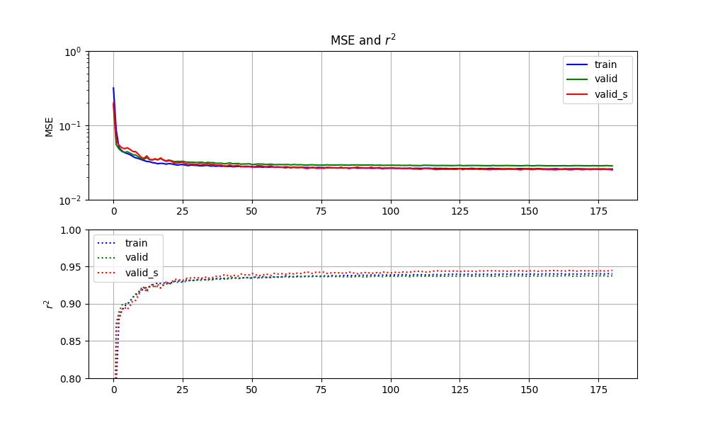
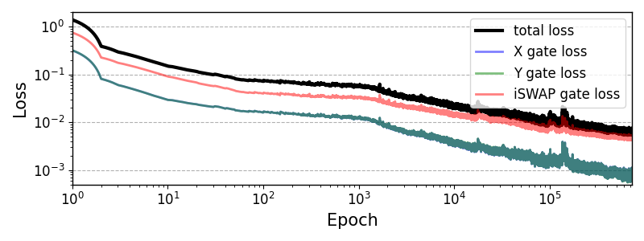

# GNNlargeSQC

## Versions

- **Python**: 3.10.12
- **Torch**: 2.1.0+cu121
- **NumPy**: 1.26.2
- **Matplotlib**: 3.8.1

It should be noted that, according to the author's experience, **earlier torch versions do cause errors**.

## File Structure

```plaintext
GNNlargeSQC/
│
├── Crosstalk_open/     # main directory
│   ├── envs/           # for evaluator (estimator in code)
│   ├── mitigator/      # for designer (mitigator in code)
│   ├── models/         # model for evaluator
│   ├── models_GNNlayers/   # model for designer
│   ├── QubitsGraph/    # generating random graphs
│   └── README.md
│
└── data_saving/        # datas from simulations
    ├── 0601-1958_/
    └── 20250409_/     
```

## Running the Code

### 1. Training the evaluator (estimator in code)

```bash
python3 Crosstalk_open/envs/estimator/fit_SmallGraphs_single.py
python3 Crosstalk_open/envs/estimator/fit_SmallGraphs_iSWAP.py
```

the results for test sets will be printed, and the the training curve will be available in `envs/estimator/results_train`, i.e.,



To test the trained evaluator (estimator) on datasets with 30 qubits, you can run

```bash
python3 Crosstalk_open/envs/estimator_test30Q/Z30Q_test_single.py
python3 Crosstalk_open/envs/estimator_test30Q/Z30Q_test_iSWAP.py
```

and the results will be printed.

### 2. Training the designer (mitigator in code)

```bash
python3 Crosstalk_open/mitigator/DGCNacm_train_multiscale.py
```

Notice that your GPU memory should be larger than $20$ GB. The results in the training process will be printed, and if you want to see the training curve, you can run

```bash
python3 Crosstalk_open/mitigator/DGCN_train_plot.py
```

thus the training curve will be available in `mitigator/results/loss.png`, i.e.,



Your training results will be saved every $1000$ epochs.

### 3. Test the designer (mitigator in code)

To test the trained designer (mitigator), you can run
```bash
python3 Crosstalk_open/mitigator/DGCN_test.py
```
and the results will be printed.

## Citation

If you find this code useful, please cite our paper:

Hao Ai and Yu-xi Liu, *Scalable parameter design for superconducting quantum circuits with graph neural networks*, (2025).